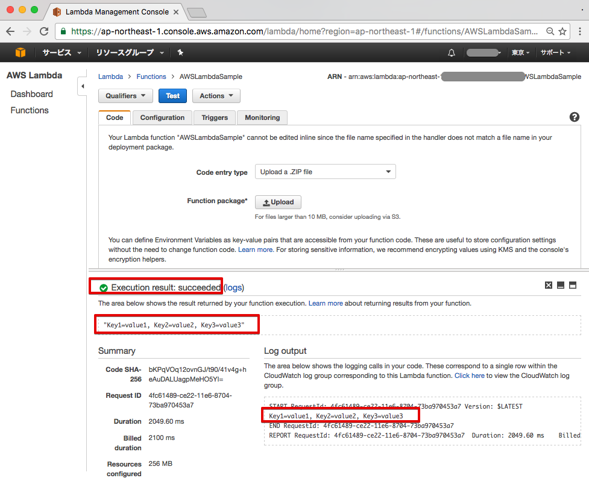

# AWSLambdaSample
AWS Lambda(C#) をVisual Studio for Macで作成するための雛形

作業手順は、以下のとおりです。

### (1) githubからのclone作成
```
$ git clone https://github.com/furuya02/AWSLambdaSample
```

### (2) Visual Studio for Macで開く

Visual Studio for Macのメニューから ファイル > 開く > AWSLambdaSample.sln

（パッケージは自動的に復元されますが、もし、エラーとなっていたりした場合は、パッケージ > 復元 で強制的に復元して下さい）

ソリューションエクスプローラーからFunction.csを開いてみて下さい。
<tt>Function.FunctionHandler</tt>が、Lambdaファンクションの本体です


### (3) デバッグ実行

<tt>Function.FunctionHandler</tt>の中で、適当な所にブレークポイントを設定し、デバッグ実行してみると、ブレークポイントで停止して、変数等が確認出来ることを見ることができます。


### (4) コンパイル・パッケージ作成・デプロイ

project.jsonの存在するフォルダに移動します。
```
$ ls -la
total 56
drwxr-xr-x  11 sin  staff   374 12 30 08:36 .
drwxr-xr-x   9 sin  staff   306 12 30 08:34 ..
-rw-r--r--   1 sin  staff  1267 12 30 08:34 AWSLambdaSample.csproj
-rw-r--r--   1 sin  staff   294 12 30 08:34 AWSLambdaSample.csproj.user
-rw-r--r--   1 sin  staff   586 12 30 08:34 Function.cs
-rw-r--r--   1 sin  staff   697 12 30 08:34 Program.cs
-rw-r--r--   1 sin  staff   306 12 30 08:34 aws-lambda-tools-defaults.json
drwxr-xr-x   3 sin  staff   102 12 30 08:36 bin
-rw-r--r--   1 sin  staff   686 12 30 08:34 createLambdaPacket.pi
drwxr-xr-x   6 sin  staff   204 12 30 08:36 obj
-rw-r--r--   1 sin  staff   533 12 30 08:34 project.json
```

ここで、createLambdaPacket.piを実行します。
このシェルでは、作業フォルダを作成し、ライブラリの復元、コンパイル、パッケージ作成、デプロイまでを行います。
なお、シェルの最後の方で、AWS Lambda functionの名前と、IAMロールの指定を問うプロンプトが表示されますので、入力が必要です。

```
$ python createLambdaPacket.pi
Function.cs
log  : Restoring packages for /Users/hirauchishinichi/Documents/work3/AWSLambdaSample/AWSLambdaSample/AWSLambdaSample/project.json...
log  : Restoring packages for tool 'Amazon.Lambda.Tools' in /Users/hirauchishinichi/Documents/work3/AWSLambdaSample/AWSLambdaSample/AWSLambdaSample/project.json...
log  : Writing lock file to disk. Path: /Users/hirauchishinichi/Documents/work3/AWSLambdaSample/AWSLambdaSample/AWSLambdaSample/project.lock.json
log  : /Users/hirauchishinichi/Documents/work3/AWSLambdaSample/AWSLambdaSample/AWSLambdaSample/project.json
log  : Restore completed in 2707ms.
Executing publish command
... invoking 'dotnet publish', working folder '/Users/hirauchishinichi/Documents/work3/AWSLambdaSample/AWSLambdaSample/AWSLambdaSample/bin/Release/netcoreapp1.0/publish'
... publish: Publishing AWSLambdaSample for .NETCoreApp,Version=v1.0
... publish: Project AWSLambdaSample (.NETCoreApp,Version=v1.0) will be compiled because expected outputs are missing
... publish: Compiling AWSLambdaSample for .NETCoreApp,Version=v1.0
... publish: Compilation succeeded.
... publish:     0 Warning(s)
... publish:     0 Error(s)
... publish: Time elapsed 00:00:01.6818108
... publish:
... publish: publish: Published to /Users/hirauchishinichi/Documents/work3/AWSLambdaSample/AWSLambdaSample/AWSLambdaSample/bin/Release/netcoreapp1.0/publish
... publish: Published 1/1 projects successfully
Changed permissions on published dll (chmod +r Amazon.Lambda.Core.dll).
Changed permissions on published dll (chmod +r Amazon.Lambda.Serialization.Json.dll).
Changed permissions on published dll (chmod +r AWSLambdaSample.dll).
Changed permissions on published dll (chmod +r Newtonsoft.Json.dll).
Changed permissions on published dll (chmod +r System.Runtime.Serialization.Primitives.dll).
Zipping publish folder /Users/hirauchishinichi/Documents/work3/AWSLambdaSample/AWSLambdaSample/AWSLambdaSample/bin/Release/netcoreapp1.0/publish to /Users/hirauchishinichi/Documents/work3/AWSLambdaSample/AWSLambdaSample/AWSLambdaSample/bin/Release/netcoreapp1.0/AWSLambdaSample.zip
... publish:   adding: Amazon.Lambda.Core.dll (deflated 57%)
... publish:   adding: Amazon.Lambda.Serialization.Json.dll (deflated 55%)
... publish:   adding: AWSLambdaSample.deps.json (deflated 72%)
... publish:   adding: AWSLambdaSample.dll (deflated 64%)
... publish:   adding: AWSLambdaSample.pdb (deflated 37%)
... publish:   adding: Newtonsoft.Json.dll (deflated 60%)
... publish:   adding: System.Runtime.Serialization.Primitives.dll (deflated 48%)
Created publish archive (/Users/hirauchishinichi/Documents/work3/AWSLambdaSample/AWSLambdaSample/AWSLambdaSample/bin/Release/netcoreapp1.0/AWSLambdaSample.zip).
Lambda project successfully packaged: /Users/hirauchishinichi/Documents/work3/AWSLambdaSample/AWSLambdaSample/AWSLambdaSample/bin/Release/netcoreapp1.0/AWSLambdaSample.zip
Executing publish command
Deleted previous publish folder
... invoking 'dotnet publish', working folder '/Users/hirauchishinichi/Documents/work3/AWSLambdaSample/AWSLambdaSample/AWSLambdaSample/bin/Release/netcoreapp1.0/publish'
... publish: Publishing AWSLambdaSample for .NETCoreApp,Version=v1.0
... publish: Project AWSLambdaSample (.NETCoreApp,Version=v1.0) was previously compiled. Skipping compilation.
... publish: publish: Published to /Users/hirauchishinichi/Documents/work3/AWSLambdaSample/AWSLambdaSample/AWSLambdaSample/bin/Release/netcoreapp1.0/publish
... publish: Published 1/1 projects successfully
Changed permissions on published dll (chmod +r Amazon.Lambda.Core.dll).
Changed permissions on published dll (chmod +r Amazon.Lambda.Serialization.Json.dll).
Changed permissions on published dll (chmod +r AWSLambdaSample.dll).
Changed permissions on published dll (chmod +r Newtonsoft.Json.dll).
Changed permissions on published dll (chmod +r System.Runtime.Serialization.Primitives.dll).
Zipping publish folder /Users/hirauchishinichi/Documents/work3/AWSLambdaSample/AWSLambdaSample/AWSLambdaSample/bin/Release/netcoreapp1.0/publish to /Users/hirauchishinichi/Documents/work3/AWSLambdaSample/AWSLambdaSample/AWSLambdaSample/bin/Release/netcoreapp1.0/AWSLambdaSample.zip
... publish:   adding: Amazon.Lambda.Core.dll (deflated 57%)
... publish:   adding: Amazon.Lambda.Serialization.Json.dll (deflated 55%)
... publish:   adding: AWSLambdaSample.deps.json (deflated 72%)
... publish:   adding: AWSLambdaSample.dll (deflated 64%)
... publish:   adding: AWSLambdaSample.pdb (deflated 37%)
... publish:   adding: Newtonsoft.Json.dll (deflated 60%)
... publish:   adding: System.Runtime.Serialization.Primitives.dll (deflated 48%)
Created publish archive (/Users/hirauchishinichi/Documents/work3/AWSLambdaSample/AWSLambdaSample/AWSLambdaSample/bin/Release/netcoreapp1.0/AWSLambdaSample.zip).
Enter Function Name: (AWS Lambda function name)
AWSLambdaSample
Creating new Lambda function
Select IAM Role that Lambda will assume when executing function:
    1) lambda_exec_test
    2) *** Create new IAM Role ***
1
New Lambda function created
```
上記では、AWS Lambda function nameを**AWSLambdaSample**としました。（名前については、なんでも構いません。）
また、IAMロールについては、予め、作成済みの**lambda_exec_test**を使用しました。


AWSコンソールを開くと、今、デプロイしたファンクションが出来ていることを確認できます。


### (5) テスト実行

この雛形は、デフォルトのテスト用ペーロードで動作するようになっておりますので、**Test**ボタンを押すと、下記のように、**Execution result: succeeded**で、戻り値、ログなども確認することができます。




